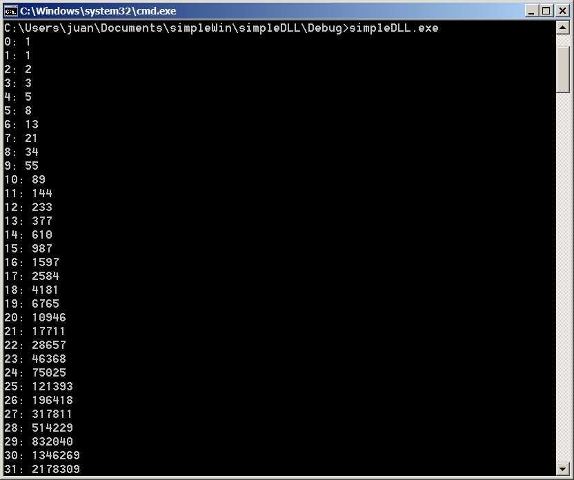
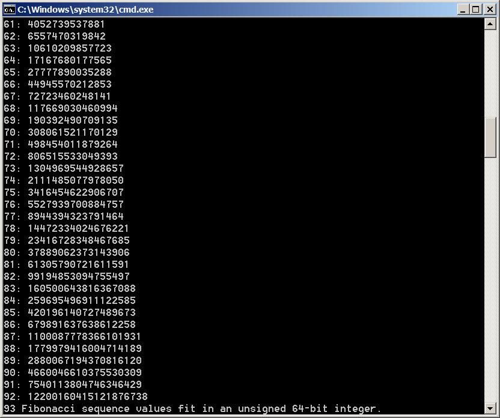

# SimpleDLL

This solution has two modules: **MathLibrary** and **MathClient**.

## MathLibrary

**MathLibrary** is the dll that **MathClient** uses.

## MathClient

This project needs some aditional configuration in order to use the *dll*s produced by the other project. It is all described in the Microsoft doc linked in the *Resources* section. 

The output is:

## Resources
+ https://docs.microsoft.com/en-us/cpp/build/walkthrough-creating-and-using-a-dynamic-link-library-cpp?view=vs-2019
